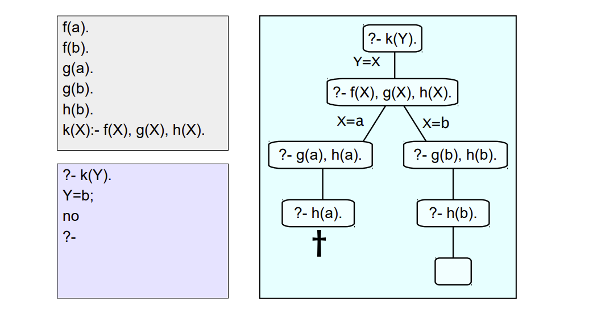

# Unificación

Operación entre terminos, implica hacer identicos dos terminos.
Por ejemplo como una variable se puede igualar a cualquier termino se puede unificar entre `mujer(X)` y `mujer(mia)`.

### Definición:
  - Si T<sub>1</sub> y T<sub>2</sub> son constantes, entonces T<sub>1</sub> y T<sub>2</sub> unifican si son identicos.
  - Si T<sub>1</sub> es una variable y T<sub>2</sub> es cualquier tipo de termino, entonces T<sub>1</sub> y T<sub>2</sub> unifican, y T<sub>1</sub> se instancia en T<sub>2</sub> (y viceversa)
  - Si T<sub>1</sub> y T<sub>2</sub> son terminos complejos, unifican si:
    - tienen el mismo functor y aridad,
    - todos los argumentos unifican,
    - las instanciaciones de variables son compatibles.

### Ejercicio:
Programa prolog que indique si una linea recta es horizontal (/Y), es decir, paralela al eje de las X (/Y).
```prolog
horizontal(linea(punto(X1, Y1), punto(X2, Y2))) :- Y1 = Y2.
vertical(linea(punto(X1, Y1), punto(X2, Y2))) :- X1 = X2.
```
se puede simplificar mas aún:
```prolog
horizontal(linea(punto(X1, Y1), punto(X2, Y1)).
vertical(linea(punto(X1, Y1), punto(X1, Y2))).
```

# Busqueda de pruebas

Prolog tiene un procedimiento especifico para buscar respuestas especificas a una consulta.

Sigue un orden predefinido según:
 - Siguiente predicado en la consulta a satisfacer
 - Cláusula en el programa a utilizar



Se puede utilizar trace para verificar que el árbol resultante es correcto.

# Recursión

### Naturales:
```prolog
natural(0).
natural(s(X)):- natural(X).
```

### Operaciones:

A través de inducción estructural sobre los naturales.

```prolog
% suma(X,Y,Z) <- Z es el resultado
suma(0, X, X).
suma(s(X), Y, s(Z)) :- suma(X, Y, Z).

% resta(X, Y, Z) <- suma(Y, Z, X)

mayor(s(X), 0).
mayor(s(X), s(Y)) :- mayor(X, Y).
```

