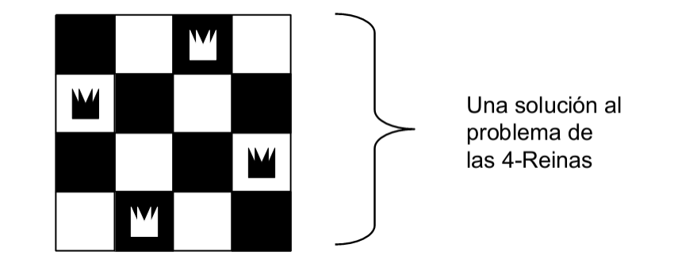
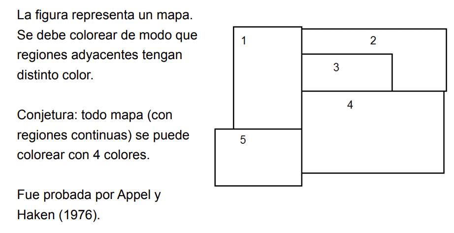

# Generación y chequeo

 - Técnica para diseñar y programar algoritmos.
 - Un proceso genera soluciones candidatas al problema.
 - Otro proceso chequea los candidatos, intentando encontrar aquel o aquellos que resuelvan el problema.

### Forma General

 ```prolog
 solucion(X) :- generacion(X), chequeo(X).
 ```

### Método

 - generacion(X) retorna candidatos X tales que X tiene el formato de una eventual solución.
 - chequeo(X) verifica si X satisface todas las condiciones de una solución.

### Sorting
Deseamos ordenar una lista de n números.
Describimos las propiedades de una solución.

```prolog
ordenar(L,P) :- permutacion(L, P), ordenada(P).

%permutacion(+L, ?P) <- La lista P es una permutación de la lista L.
```

Idea de permutación:
 - Seleccionamos un 1er elemento de la solución (cualquier elemento de la lista).
 - El resto es una permutacion de los restantes elementos de la lista.

```prolog
%select(?E, +L, ?LSinE) <- E es un elemento de L y LSinE es L sine l elemento E
select(X, [X|Xs], Xs).
select(X, [Y|Xs], [Y|R]) :- select(X, Xs, R).

%ordenada(+L) <- La lista de números L está ordenada en forma ascendente.
ordenada([_]).
ordenada([X, Y|R]) :- X =< Y, ordenada([Y|R]).
```

Esto es muy ineficiente, pero es correcto.

#### Problema: ineficiente
Una solución a este problema consiste en "empujar" el chequeo dentro del generador lo más profundo posible.

### Problema de las N-Reinas
Distribuir N reinas en un tablero de NxN, de forma que todo casillero del tablero quede atacado por una reina y ninguna reina sea atacada por otra.



Dado que cada fila y cada columna va a tener una reina podemos aprovechar para simplificar y representar escribiendo solo la fila o columna.

```prolog
% En el ejemplo el lugar representa la columna. 
[2, 4, 1, 3]
```

```prolog
reinas(N, Qs) :- 
    primeros(N, Ns), 
    permutacion(Ns, Qs), 
    segura(Qs).

%primeros(+N, ?Ns) <- Inicializa la lista Ns con N posiciones diferentes, 
%entonces tenemos una reina en cada columna y además todas están en diferentes filas.

segura([Q|Qs]) :-
   no_ataca(Q, Qs),
   segura(Qs).
segura([]).

no_ataca(X, Xs) :- no_ataca(X, 1, Xs).
no_ataca(_, _, []).
no_ataca(X, N, [Y|Ys]) :-
    X =/= Y+N,
    X =/= Y-N,
    N1 is N+1,
    no_ataca(X, N1, Ys).
```

#### Problema: ineficiente
Una mejora sería que a medida que se arma la estructura se vaya chequeando si la ubicacion de la reina es legal.

#### Mejora
```prolog
reinas(N,Qs) :-
    primeros(N,Ns),
    reinas(Ns,[],Qs). % agrego un argumento como acumulador

reinas(SinColocar,Seguras,Qs) :-
    select(Q,SinColocar,SinColocar1),
    no_ataca(Q,Seguras),
    reinas(SinColocar1,[Q|Seguras], Qs).
reinas([],Qs,Qs). % paso base: el acumulador contiene la solución

select :- ...

no_ataca :- ...
```

### Coloración de mapas



 - Generación: pintamos todas las regiones con algún color
 - Chequeo: no hay regiones vecinas con el mismo color 

Declaramos regiones:
```prolog
regiones([1,2,3,4,5]).
```

Vecinos:
```prolog
vecinos(1,[2,3,4,5]).
vecinos(2,[1,3,4]).
vecinos(3,[1,2,4]).
```

Colores:
```prolog
colores([rojo, verde, amarillo, azul, violeta, gris]).
```

Mapa coloreado:
```prolog
[(1, rojo), (2, verde), ...]
```

#### Generación

```prolog
mapa_coloreado(MapaColor) :-
    genera(MapaColor),
    sin_conflicto(MapaColor).

genera(MapaColor) :-
    regiones(R),
    colores(C),
    pintar(R,C,MapaColor).

pintar([],_,[]).
pintar([R|Rs],C,[(R,C1)|RM]) :-
    member(C1,C),
    pintar(Rs,C,RM).
```

#### chequeo

```prolog
sin_conflicto([_]).
sin_conflicto([(R,C)|RM]) :-
    sin_conflicto(R,C,RM),
    sin_conflicto(RM).

sin_conflicto(R,C,RM) :-
    vecinos(R,Vs),
    todos_color_distinto(C,Vs,RM).

todos_color_distinto(_,[],_).
todos_color_distinto(C,[V|Vs],RM) :-
    not_member((V,C),RM),
    todos_color_distinto(C,Vs,RM).

not_member(_,[]).
not_member(X,[Y|Resto]):-
    X \= Y,
    not_member(X,Resto).
```

#### Problema: ineficiente
Esto es exponencial.

#### Mejora
Incluir chequeo en la generación.
El objetivo  es fallar lo antes posible si una asignación de color no sirve.
