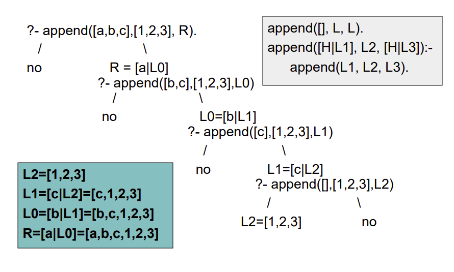

# Listas

 - Estructura de datos recursiva.
 - member/2 es el predicado utilizado para la definición de listas.?
 - Secuencia finita de elementos.
 
### Lista no vacia
término complejo con dos argumentos:
 - Cabeza de la lista (1er elemento).
 - Resto (una lista).
### Lista vacía
`[]`, es un átomo, no tiene cabeza ni resto.

### Operador |

Se utiliza para descomponer una lista en Cabeza y Resto.

### Variable anónima
Cuando necesitamos una variable pero no nos interesa el valor en el que se instancie, se escribe como `_` y cada ocurrencia es independiente.

### Member/2

Predicado que dado un elemento X y una lista L nos dice si X está en L.

Recorre recursivamente la lista, procesando primero la cabeza y luego el resto recursivamente.

### Ejemplo

Predicado con 2 listas como argumentos, se satisface si:
 - El 1er argumento es una lista de a's y
 - El 2do argumento es una lista de b's del mismo largo.

 ```prolog
 a2b([],[]).
 a2b([a|R1], [b|R2]) :- a2b(R1, R2).
 ```

### Append/3

Predicado que realiza la concatenación de 2 listas.

```prolog
append([], L, L).
append([H|L1], L2, [H|L3]) :- append(L1, L1, L3).
```



### Prefijo de L
Lista que contiene los primeros n elementos de una lista L.

```prolog
prefijo(L, []).
prefijo([X|Y], [X|Z]) :- prefijo(Y,Z).

% usando append
prefijo(L, Pref) :- append(Pref, _, L).
```

### Sufijo de L
Lista que contiene los ultimos n elementos de una lista L.

```prolog
sufijo(L, Suf) :- append(_, Suf, L).
```

### Sublista
Predicado que encuentra sublistas en una lista.
Son los prefijos de los sufijos

```prolog
sublista(Sub, Lista) :- sufijo(Sufijo, Lista), prefijo(Sub, Sufijo).
```

### Naive Reverse

Se pierde mucho tiempo en realizar appends.

```prolog
naiveReverse([], []).
naiveReverse([H|T], R) :- naiveReverse(T, RT), append(RT, [H], R).
```

### Reverse con wrapper

##### Acumulador
Es una lista donde se construye el resultado.

Cada elemento de la lista se coloca en la cabeza del acumulador, y este se pasa como argumento en la recursión, de forma que al llegar a la lista vacía el acumulador contiene el reverso de la lista original.

```prolog
reverseAc([], Ac, Ac).
reverseAc([H|T], Ac, Rev) :- reverseAc(T, [H|Ac], Rev).

reverse(L1, L2) :- reverseAc(L1, [], L2).
```

# Patrones de instanciación

Documentamos los usos intentados de un predicado con las instanciaciones de argumentos admisibles.

 - `+A`: A debe estar instanciado
 - `-A`: A no debe estar instanciado
 - `?A`: A puede o no estar instanciado
