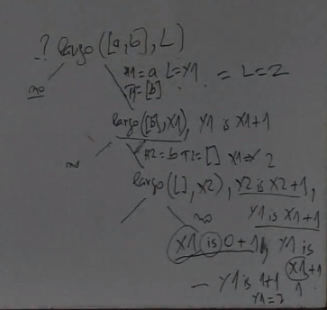
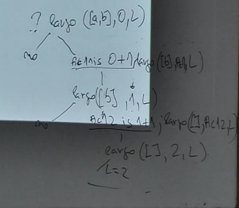

# Aritmética

## Predicado del sistema *is*
 - is (Valor, Expresion)
 ```prolog
 ?- is(3,2+1).
 true.
 ```

 - Notación infija:
 ```prolog
 ?- 3 is 2+1.
 true.
 ```

Evalua Expresion y se unifica con Valor.

*is* exige que la expresión a evaluar tenga el tipo adecuada: números o variables instanciadas en valores numéricos.

>Con predicados del sistema puede darse una situación de error a diferencia de cuando se trabaja con prolog "puro"

## <, =<, >, >=, =:=, =/=

 - Son operadores infijos.

 - Realizan evaluación de ambas expresiones.

 - Toda variable debe estar instanciada.

## Largo de una lista

### Inducción en la estructura.
 - La lista vacía tiene largo 0.
 - El largo de la lista `[H|T]` es el largo de la lista `T` más 1.

```prolog
largo([],0).
largo([H|T], Y) :- largo(T, X), Y is X + 1.
```

### Con acumulador:

```prolog
% Encapsulo largo con acumulador
largo(Lista, Largo) :- largo(Lista, 0, Largo).

largo([],X,X).
largo([H|T], Ac, X) :- Ac1 is Ac+1, largo(T, Ac1, X).
```
Se inicializa `Ac` en `0` y `X` es el resultado.

### Árbol de búsqueda de `?- largo([a,b,c],L)`:





### Comparando ambas versiones de largo

#### Tail recursion
Es cuando la invocación recursiva se hace en el último predicado del lado derecho.

 - Mayor eficiencia dado que no hay que hacer cálculos ni guardar valores de variables en el stack de ejecución.

 - Utilizando acumuladores puede ser más fácil obtener un programa *tail-recursive*.

## Máximo de una lista

### Inducción

```prolog
% max(+L, ?M) <- M es el máximo de la lista de enteros L
max([X], X).
max([X|L], M) :- max(L, M), M >= X.
max([X|L], X) :- max(L, M), M < X.
```

### Con acumulador

```prolog
% este primer paso es para que falle si la lista es vacía y sea mas facil para llamar a la función
max([X|L], M) :- max([L, X, M).

max([X|L], AcMax, M) :- X >= AcMax, max(L, X, M).
max([X|L], AcMax, M) :- X < AcMax, max(L, AcMax, M).
max([], M, M). 
```

> De nuevo es mas eficiente con acumulador.
