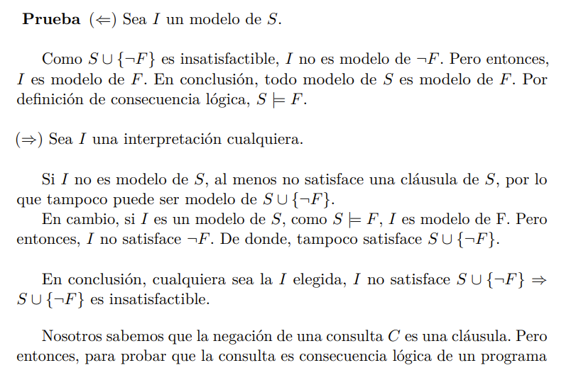

# Fundamentos teóricos

# Lógica de primer orden

## Sintaxis

### Alfabeto de 1er orden

Consituido por:
 - variables (x, y, z, ...)

 - constantes (a, b, c, ...)

 - functores (f, g, h, ...)

 - símbolos de predicados (p, q, r, ...)

 - conectivos: $\neg, \to, \leftrightarrow, \wedge, \vee$

 - cuantificadores: $\forall, \exists$

 - puntuación: ')', '(', ','

### Término
 1. Una variable es un término

 1. Una constante es un término.

 1. Si f es una función n-aria y t1 ... tn términos, f(t1, ..., tn) es un término.

 1. Estos son todos los terminos

### Fórmula bien formada

 1. Si p es un predicado n-ario y t1 ... tn términos, p(t1, ..., tn) es una fórmula (átomo o fórmula atómica).

 1. Si F y G son fórmulas, también lo son:
    - ($\neg$F)

    - (F $\vee$ G)

    - (F $\wedge$ G)

    - (F $\to$ G)

    - (F $\leftrightarrow$ G)
 
 1. Si F es una fórmula y x una variable, también son fórmulas:
    - ($\exists$ x F)

    - ($\forall$ x F)

 1. Estas son todas las fórmulas.

### Lenguaje de primer orden

Es el conjunto de fórmulas bien formadas que se pueden construir con los símbolos del alfabeto.

### Alcance de un cuantificador

El alcance de $\exists$ en ($\exists$ x F) es F;
el alcance de $\forall$ en ($\forall$ x F) es F

### Variables ligadas/libres

Una ocurrencia de una variable está ligada si está inmediatamente luego de un cuantificador o es una ocurrencia dentro del alcance de un cuantificador.

En caso contrario, diremos que la ocurrencia se encuentra libre.

Se dice que la variables es una variable ligada (libre) cuando todas sus ocurrencias están ligadas (libres).

### Fórmula cerrada

Una fórmula cerrada es una fórmula que no presenta ocurrencias de variables libres.

> Los teoremas matemáticos y las clausulas de un problema lágico son formulas cerradas, se utilizan para hacer demostraciones. Son formulas que toman algun valor de verdad según la interpretación

### Clausura universal (existencial)

$\forall$(F) es la **clausura universal** de F, y se obtiene agregando un cuantificador universal por cada variable con una ocurrencia libre en F.

Análogamente, la **clausura existencial** $\exists$(F) se obtiene agregando un cuantificador existencial por cada variable con una ocurrencia libre en F.

### Literal

Un *literal* es un átomo (literal positivo) o su negado (literal negativo).

### Cláusula

Una cláusula es una fórmula cerrada con la siguiente forma:
$$\forall x_1 ...~x_k (L_1 \vee ... \vee L_p)$$

en donde cada $L_i$ es un literal y $x_1 ...~x_k$ son todas las variables que ocurren en $L_1 \vee ... \vee L_p$

Se utilizaran indistintamente las siguientes notaciones para las cláusulas:
 $$\forall x_1 ...~x_k (A_1 \vee ... \vee A_p \vee \neg B_1 \vee ... \vee \neg B_q)$$

 $$(A_1 \vee ... \vee A_p \leftarrow B_1 \wedge ... \wedge B_q)$$

 $$\{A_1, ..., A_p, \neg B_1, ..., \neg B_q\}$$

### Cláusula definida

Una cláusula definida es una cláusula que contiene exactamente un literal positivo.

 - regla: $A_1 \leftarrow B_1 \wedge ... \wedge B_q$
 - cláusula unitaria o hecho: $A_1 \leftarrow $

### Programa definido

Un programa definido es un conjunto de cláusulas definidas (reglas y hechos).

### Objetivo definido

Un objetivo definido es una cláusula sin literales positivos:
$$\leftarrow B_1, ..., B_q$$

>Esto es la consulta

### Cláusula de Horn

Una cláusula de Horn es una cláusula definida o un objetivo definido.

Tanto los programas lógicos (conjuntos de cláusulas definidas) como las consultas van a ser modeladas con cláusulas de Horn.

Las consultas van a ser negadas para así obtener objetivos definidos.

## Semántica

Para decir que una fórmula es verdadera o falsa es necesario darles algún significado a los símbolos en la fórmula.

### Interpretación

Sea $L$ un lenguaje de 1er orden.

Una interpretación $I$ para $L$ consiste en :

 - Un conjunto $D$ no vacío (dominio de la interpretación)

 - Un mapeo $M_c$ de las constantes de $L$ en $D$.

 - Un mapeo $M_f$ para los símbolos de función de $L$, tal que a $f$ n-ario le corresponde una función $D_n \to D$

 - Un mapeo $M_p$ para los símbolos de predicado de $L$, tal que a $p$ n-ario le corresponde una función $D_n \to \{v, f\}$ (es decir, una relación en $D_n$
 
### Valor de una fórmula $F$ según una interpretación $I$ y una asignacion $V$

#### Atómica

1. A cada variable se le da un valor $h(v)$ según V.

1. A cada constante c se le da un valor $h(c)$ según I, $h(c) = M_c(c)$.

1. El valor asociado a un término $f(t_1, ..., t_n)$ es $h(f(t_1, ..., t_n) = M_f(h(t_1), ..., h(t_n))$ ($h(f)$ en $D$).

1. El valor de verdad asociado a una fórmula atómica $p(t_1, ..., t_n)$ es $M_p(h(t_1), ..., h(t_n))$.

#### Conectivos

$F$ es de la forma:

$$F1 \wedge F2$$

$$F1 \vee F2$$

$$F1 \to F2$$

$$\neg F1$$

En este caso se utiliza la tabla de verdad de los conectivos:

 
#### Cuantificadores

$F$ es de la forma:

$$\exists x~P(x)$$

$$\forall x~P(x)$$

 1. $F$ es verdadera si existe $d \in D$, tal que $G$ es verdadera para $I$ y $V (x/d)$, donde $V (x/d)$ es $V$ excepto para la variable $x$, a la que se le asigna el valor $d$; en caso contrario es falsa.

 1. $F$ es verdadera si para cada $d \in D$, $G$ es verdadera para $I$ y $V (x/d)$; en caso contraria es falsa.

### Modelos

#### Definición

Sea $F$ una fórmula cerrada e $I$ una interpretación, $I$ es un **modelo** para $F$ si $F$ es verdadera según $I$ ($I$ satisface $F$).

Sea $S$ un conjunto de fórmulas cerradas, $I$ es un modelo para $S$ si satisface todas las fórmulas de $S$.

#### Satisfactible/Válido

Sea $S$ un conunto de fórmulas cerradas

 - $S$ es **satisfactible** si extiste al menos un modelo para $S$.

 - $S$ es **válido** (lógicamente valido) si toda interpretación es modelo.

 - $S$ es **insatisfactible** si ninguna interpretación es modelo.

#### Consecuencia lógica

Sea $S$ un conjunto de fórmulas cerradas y $F$ una fórmula cerrada:

$F$ es **consecuencia lógica** de $S$ si todo modelo de $S$ es modelo de $F$. ($S \models F$)

##### Teorema

Sea $S = \{F_1, F_2, ..., F_n\}$, $F$ es consecuencia lógica de S sii $(F_1 \wedge F_2 \wedge ... \wedge F_n) \to F$ es una fórmula válida.

##### Teorema

Sea $S$ un conjunto de formulas cerradas y $F$ una fórmula cerrada sobre $L$ de primer orden:
$$ S \models F~\text{ sii }~S \cup \{\neg F\} \text{ es insatisfactible.}$$ 

###### Demostración

  
Expandir

  
  

# Pruebas en prolog

Para probar que una consulta $C$ es consecuencia lógica de un programa lógico $P$ ($P \models C$) basta con probar que $ P \cup \{\neg C\} $ es insatisfactible.

A este tipo de demostración se le llama **prueba por refutación**: se niega lo que se quiere probar, llegando a un absurdo.

Debemos buscar una forma automática de resolver este problema, para esto se introducen los **métodos de resolución**.

> Un programa lógico P es un conjunto de cláusulas definidas.
> G, la negación de una consulta C, es una cláusula con todos los literales negativos.
> Deseamos probar $P \models C$, para esto se prueba que $P \cup \{G\}$ es insatisfactible.

## Sustituciones

Si tenemos variables libres podemos sustituirlas por terminos cualesquiera.

### Definición

Una sustitución $\theta$ es un conjunto finito de la forma $\{v_1/t_1, ..., v_n/t_n\}$ en donde, para $1 \leq i \leq n$:
 
 - $v_i$ es una variable,
 
 - $t_i$ es un término distinto de $v_i$,
 
 - $v_i \neq v_j $ si $ i \neq j$

## Instancia

### Instancia de una fórmula según una sustitución.

Sea $E$ una expresión (término o fórmula sin cuantificadores), y $\theta = \{v_1/t_1, ..., v_n/t_n\}$ una sustitución:

$E\theta$, **instancia** de $E$  por $\theta$, es el resultado de la aplicación **simultánea** del reemplazo de cada variable $vi$ por el término $ti$ en $E$.

### Instancia de un conjunto de fórmulas según una sustitución.

Si $S = \{E_1,...,E_n\}$ es un conjunto de expresiones y $\theta$ una sustitución, $S\theta$, **instancia del conjunto** $S$ por $\theta$, es el conjunto $\{E_1\theta,...,E_n\theta\}$.

### Composición de sustituciones

Sea $\sigma = \{v_1/s_1, . . . , v_n/s_n\}$ y $\theta = \{u_1/t_1, . . . , u_m/t_m\}$ dos sustituciones:

La sustitución $\sigma \circ \theta$ es la sustitución que resulta de: $$\{v_1/s_1\theta,...,v_n/s_n\theta,u_1/t_1,...,u_m/t_m\}$$ luego de eliminar:

 - los pares $v_i/s_i\theta$ tal que $v_i = s_i\theta$

 - los pares $u_j/t_j$ tales que $u_j \in \{v_1,...,v_n\}$.

> esto es $((E\sigma)\theta)$

#### Proposición

 - $\theta \circ \varepsilon = \varepsilon \circ \theta = \theta$ (neutro)

 - $(E\theta)\sigma = E(\theta \circ \sigma)$

 - $(\gamma \circ \theta) \circ \sigma = \gamma \circ (\theta \circ \sigma)$

## Unificación

### Unificador

Sea S un conjunto de expresiones.
Una sustitución $\theta$ es un unificador de $S$ si $S\theta$ es un conjunto con un único elemento (*singleton*).

Es decir $\theta$ es un unificador de $S$ si para todas $E_i,~E_j \in S,~E_i\theta=E_j\theta $

### Unificador más general (m.g.u.)

$\theta$ es un mgu para $E_1$ y $E_2$ si:

 1. $\theta$ es un unificador para $E_1$ y $E_2$ y

 1. si $\sigma$ es un unificador para $E_1$ y $E_2$, existe una sustitución $\gamma$ tal que $\theta \circ \gamma = \sigma$

El mgu de dos expresiones no tiene por qué ser único, pero los diferentes mgu's se diferencian por un renombre de variables.

## Algoritmo de unificación

Existe un algoritmo que determina el mgu de un conjnto de expresiones o reporta falla si las expresiones no son unificables.

La idea es recorrer las expresiones de izquierda a derecha hasta encontrar un punto en el que sean distintas. Se toman todas las subexpresiones que comienzan en esa posición y se intenta unificarlas, sustituyendo una variable por el término que corresponda.

Este proceso se repite hasta que no queden más variables o hasta que en un paso queden expresiones imposibles de unificar. Este código no puede entrar en un ciclo infinito porque en cada iteración o bien reporta «no unificación» o bien quita una variable (y la cantidad de variables de una expresión es finita).

>Insertar imagen del algoritmo

## Resolución

### Resolución para cláusulas proposicionales

### Resolución para cláusulas de primer orden

