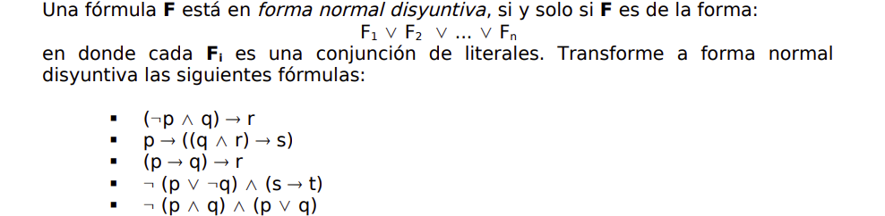

# Practico 4

## Ejercicio 1

 - $(\neg p \wedge q) \rightarrow r \underset{equiv. \rightarrow}\equiv \neg (\neg p \wedge q) \vee r \underset{De Morgan}\equiv p \vee \neg q \vee r$ 
   
 - $p \rightarrow ((q \wedge r) \rightarrow s) \underset{equiv. \rightarrow}\equiv \neg p \vee ((q \wedge r) \rightarrow s) \underset{equiv. \rightarrow}\equiv \neg p \vee \neg (q \wedge r) \vee s \underset{DeMorgan}\equiv \neg p \vee \neg q \vee \neg r \vee s$ 

 - $(p \rightarrow q) \rightarrow r \underset{equiv. \rightarrow}\equiv \neg (p \rightarrow q) \vee r \underset{equiv. \rightarrow}\equiv \neg (\neg p \vee q) \vee r \underset{DeMorgan}\equiv \underbrace{(p \wedge \neg q)}_{\text{conj. de literales}} \vee r$ 

 - $\neg (p \vee \neg q) \wedge (s \rightarrow t) \underset{DeMorgan}\equiv \neg p \wedge q \wedge (\neg s \vee t) \underset{distr.}\equiv \neg p \wedge (q \wedge \neg s) \vee (q \wedge t) \underset{conmut.~assoc.}\equiv (\neg p \wedge \neg s) \wedge q \vee (q \wedge t) \underset{abs.}\equiv \neg p \wedge \neg s \wedge q$ ???

 - $\neg (p \vee q) \wedge (p \vee q) \underset{DeMorgan}\equiv \neg p \wedge \neg q \wedge (p \vee q) \underset{distr.}\equiv \neg p \wedge ((\neg q \wedge p) \vee \underbrace{(\neg q \wedge q)}_{\bot}) \underset{ident.}\equiv \neg p \wedge \neg q \wedge p \underset{conmut.~comp }\equiv F$ 
